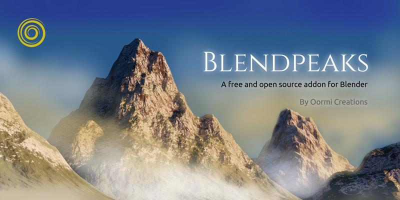

# Blendpeaks
A free and open source addon for Blender. It creates mountain peaks.

---

---

**Requirements**

* Blender 2.80 or above (_This addon was tested in Blender 2.82_)

**Features**

* Creates procedural mountain peaks in one click.
* Easy to change parameters.
* Uses Cycles displacement.

**Intro**

This very simple add-on generates models of mountain peaks with a procedural material. 

**Intro Video**

Coming soon

**Download and Installtion**

Download the Blendpeaks.py file from this repository. Or get the file from the releases page.
https://github.com/oormicreations/Blendpeaks/releases

Alt link : https://oormi.in/software/blender/Blendpeaks.py

Install from the Blender Menu > Edit > Preferences > Add-ons > Install. Pick the python file. Enable this addon.
You will find the UI in the 3D View window when you press N.

_**Do not** install the zip file. Unzip the downloaded file and pick the Blendpeaks.py file while installing._

**Usage**

Just click the **Create Peak** button!

**Divisions** define the resolution of the geometry.

**Randomize** sets up semi-random parameters for creation of a unique peak.

The following parameters can be adjusted anytime, before or after creation of the peak (Select the peak and change it).

**Height** Changes the height. Also goes in negative to create pits.

**Seed** Changes overall shape.

**Shape** Defines gross shape.

**Shape Details** Finer details.

**Ridges** Changes the sharp edges on the peak.

**Ridges Details** You can have more straight or random ridges.

**Snow** Adjust the amount of snow on the peak. It is angle dependent. Does on appear on steep slopes.

**Rock** Adjust the amount of grass/rock material on the peak.

**Reset Defaults** button will reset all parameters to default values. Else they remain stored in your blender file.

**Help | Source | Updates** brings you to this page on GitHub.

**Known Issues**

* If you have two peaks and you change the first, and select the second and try to change it, it gets all the parameters of first peak and the last setting is lost. This is because the other parameter remain in the UI, while you selected the second peak.
* **Always save your stuff!**

**Misc Info**

This plugin has been released under MIT license, which means it is free for any kind of use and modification, but has no warranties or liabilities. Please read the license before you download and use it. 

**About**

A FOSS Project by Oormi Creations.

http://oormi.in

A limited support is available via email.

oormicreations@gmail.com

May 2020.

